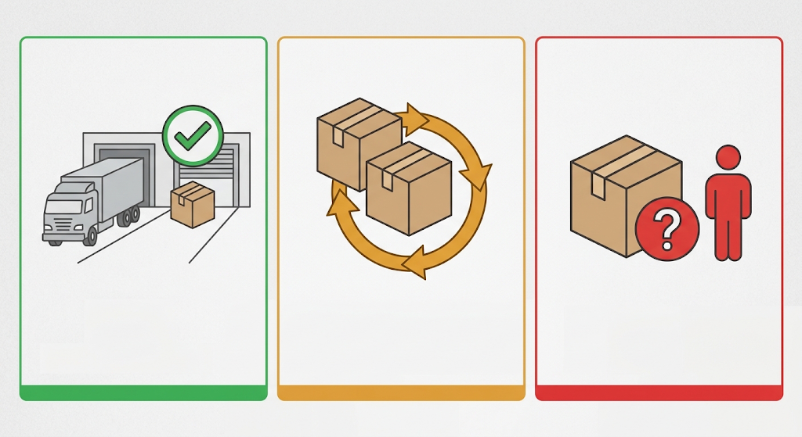
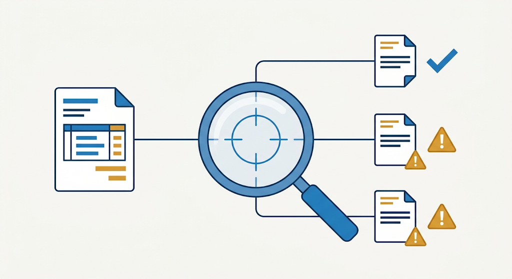

# System Design — C04 Delivery / Invoice Reconciliation

This is the design we build against. It is written before (re-)writing
application code. It draws on a v1 prototype already in `app/` — v1's data
shapes and heuristics are reused where they held up, called out explicitly
where we're changing them, and left as open questions where we're not sure.

## 1. Actors

| Actor | Role | Can do |
|---|---|---|
| **Receiving clerk** | Logs what physically arrives at the loading bay | Confirms or corrects received/damaged/accepted quantities and the new-vs-duplicate flag on a scan. Nothing is written to state without this confirmation. |
| **Invoice approver** | Reconciles an incoming invoice against what was actually received | Reviews the evidence trail for a discrepancy and approves (or does not approve) a discrepancy notice. Nothing is generated/sent without this approval. |

v1 let one free-text name stand in for either role, no auth. Carrying that
forward (see `02-client-interview.md`, open question on identity).

## 2. Entities

- **Order (PO)** — `id`, `part`, `quantity` ordered.
- **Delivery Note (DN)** — one physical delivery event against a PO:
  `id`, `order_id`, `part`, `listed_quantity`, `logged_via` (seed vs.
  clerk-confirmed).
- **Receipt** — the clerk's count for one DN: `received`, `damaged`,
  `accepted`, kept as three separate numbers (never collapsed into one
  "quantity"). `accepted = received - damaged` unless the clerk overrides it.
- **Invoice** — references one or more DNs for a PO: `id`, `order_id`,
  `delivery_notes[]`, `part`, `quantity` invoiced.
- **Discrepancy Notice** — generated only after human approval; references
  the invoice, the evidence lines, who approved it, when. Simulated output
  only (never sent).

A PO can be split across multiple DNs. An invoice can span multiple DNs. This
is the whole reason "one scan = one delivery" doesn't hold and reconciliation
needs an evidence trail instead of a single number.

## 3. Core state machine

```
Scan arrives (simulated event)
        |
        v
 classify(scan) -> NEW | DUPLICATE | AMBIGUOUS   (system proposes, never writes)
        |
        v
 clerk reviews: confirms or corrects quantities + classification
        |
        v
 [confirm] -> Receipt + DeliveryNote written to state
        |
        v
Invoice arrives (simulated event)
        |
        v
 reconcile(invoice) -> sum(accepted) across invoice's DNs vs. invoiced qty
        |
        v
 approver reviews evidence lines
        |
        +-- match -> acknowledge, no notice
        |
        +-- mismatch -> [approve] -> Discrepancy Notice (simulated, displayed only)
```

Nothing left of a "confirm"/"approve" gate ever writes state. This is the one
rule from the brief we treat as non-negotiable: **no stock or accounting
write without review.**

## 4. Classification: new vs. duplicate vs. ambiguous



Carried from v1's `classifyScan`, kept because it's a defensible first-cut
heuristic, not because it's validated:

- No existing DN for that PO/part → **NEW**.
- Exact quantity match against an existing DN, and the PO's ordered quantity
  is already fully covered by confirmed DNs → **DUPLICATE**.
- A same-size second delivery, or an unexplained-quantity extra scan, while
  the PO isn't (or is only just) fully covered → **AMBIGUOUS** — the system
  states its reasoning and refuses to pick, clerk must choose.

This is intentionally simple (exact-quantity + PO-coverage matching only). It
is the weakest part of the design and the first thing to validate against
real scan logs — see `05-wolf-handoff.md` once that's written, and the open
question in `02-client-interview.md`.

## 5. Reconciliation logic



Reconcile against **accepted** quantity, not received — a damaged unit that
was rejected should not silently show up as a "shortage" the supplier gets
blamed for, nor should it be invisibly absorbed. Sum `accepted` across every
DN tied to the invoice's PO/part, diff against invoiced quantity, and produce
one evidence line per DN explaining its contribution (e.g. "1 unit damaged
and rejected on DN-1, not credited on the invoice").

## 6. What's real vs. simulated (by design, before any code exists)

**Will be real, computed logic:**
- Classification, computed fresh from live state on every scan — not a
  scripted per-scenario answer.
- Reconciliation, computed fresh from live receipt data.
- The human-confirmation gate before any write.

**Will be simulated, and must say so in the UI:**
- The incoming scan / incoming invoice events themselves (no real scanner or
  accounting feed).
- The discrepancy notice's delivery (generated and shown, never sent).
- Identity (free-text name, not a real auth system, including the cosmetic
  login screen added on top of the Next.js UI).

**LLM-generated narrative — built, then paused (see §9):** a small
Python/LangGraph service calling Gemini was built to turn already-computed
facts into a human-readable sentence, with a templated fallback when the
service or `GEMINI_API_KEY` is unavailable. It is not wired into the app
right now — see §9 for why and where the code lives.

## 9. Mandated tool stack (event requirement, not our earlier assumption)

The event supplies a fixed toolset we must build against, given after this
design doc's first draft: **Claude Code, Next.js, LangGraph, Python,
Supabase, Gemini.** Decision on how deep to integrate each one (recorded
here so it isn't re-litigated mid-build, and updated as the decision
changed):

- **Next.js** — stays the whole UI, as already built. No change.
- **Postgres, moving to Supabase** — adopted now. Confirmed state
  (delivery notes, receipts, discarded duplicates, discrepancy notices)
  lives in Postgres (`db/schema.sql`, run via `docker-compose.yml`),
  replacing the earlier in-memory `AppState`. The schema is deliberately
  vanilla Postgres, no Supabase-specific features (no RLS, no `auth.*`),
  so moving to an actual Supabase project later is just repointing
  `DATABASE_URL` and re-running `db/schema.sql` — not a rewrite. A pending
  scan/invoice (the system's unconfirmed *proposal*) stays in memory only,
  per the "no write before confirm" rule in §3 — it was never meant to be
  durable state.
- **LangGraph + Python + Gemini** — built, then explicitly paused: "not
  using Gemini or an LLM right now, it's just a prototype." The
  `narrative-service/` directory (one LangGraph node calling Gemini to
  rephrase already-computed facts into a sentence, with a templated
  fallback) is left in the repo but not called by the Next.js app. Revisit
  if there's time; the integration point (`system_reasoning` /
  reconciliation evidence text) is unchanged and ready to reconnect.
- **Claude Code** — used throughout to build this prototype.

This keeps the deterministic, auditable core (the one thing the brief
treats as non-negotiable, see §3) untouched by an LLM, while giving the
mandated persistence tool a real, load-bearing role instead of a token
integration.

## 7. Open questions before we build

These need an answer (a stated assumption is fine, per the brief) before or
during build — tracked in `02-client-interview.md`:

1. Who actually does invoice reconciliation today — receiving or accounting?
2. What does "resolving" a flagged mismatch look like once a notice exists —
   does it just sit there, or is there a next action?
3. How urgently must a flagged discrepancy be handled (same-day? end of
   week)?
4. Is the ambiguous-scan heuristic (exact-quantity + PO-coverage) the right
   one, or is there a better signal a real clerk would use (e.g. delivery
   timing, supplier truck ID) that we can't see in this dataset?
5. Multi-line delivery notes (multiple parts per DN) and partial invoices are
   out of scope for v1 and this design — confirm that's acceptable for the
   demo before spending build time on it.

## 8. Non-goals (explicit)

- No production-grade persistence concerns (migrations tooling, backups,
  connection pooling under load) — a single Postgres instance via
  docker-compose, a reset endpoint that truncates and reseeds, single
  process. Persistence itself is real (see §9), just not hardened.
- No multi-user concurrency handling.
- No real authentication.
- No multi-part delivery notes or partial invoices.
